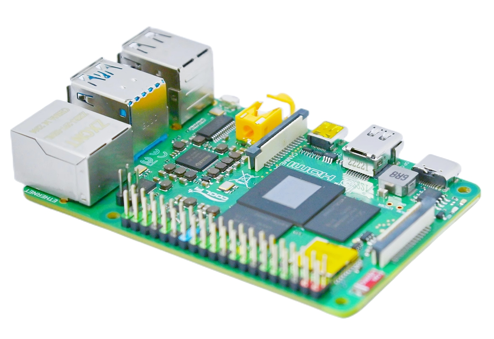
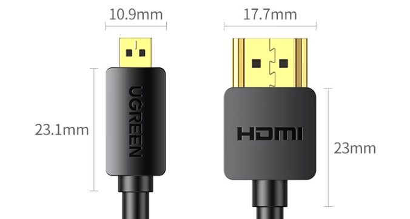
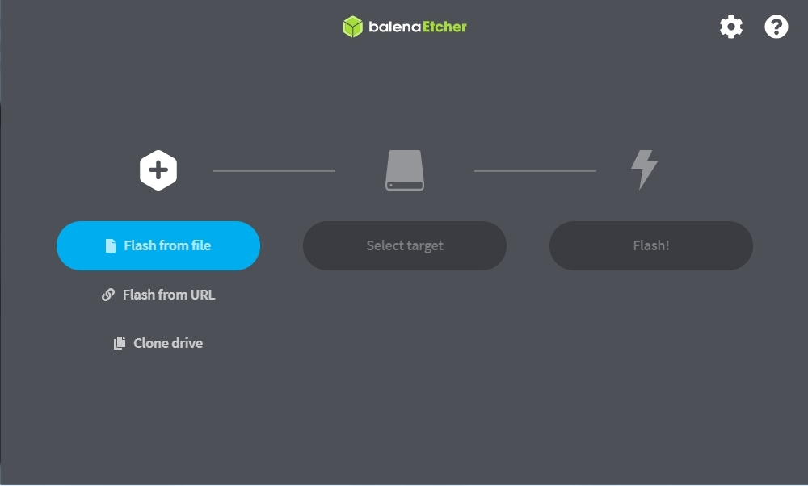
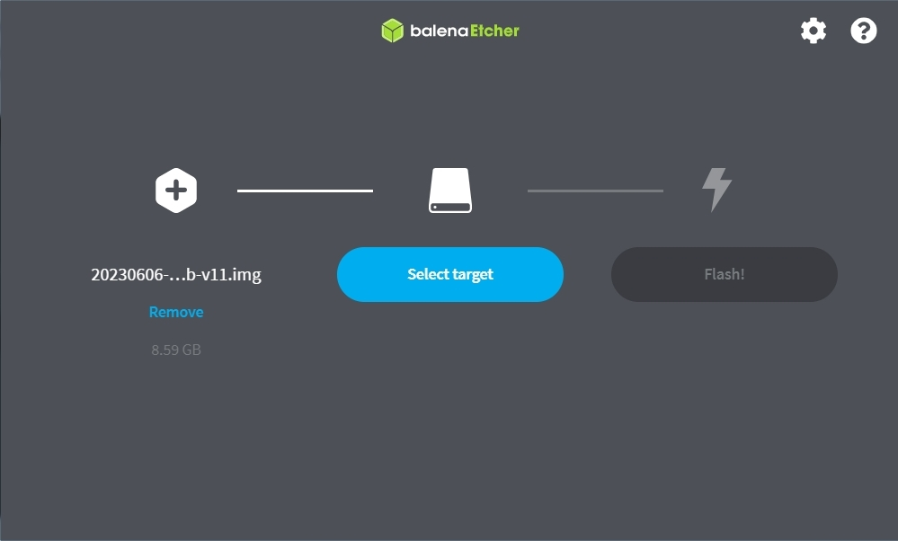
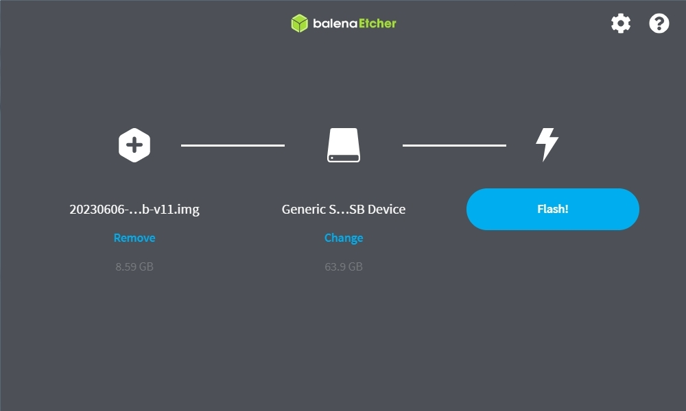
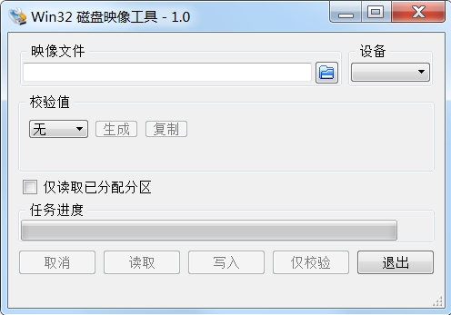
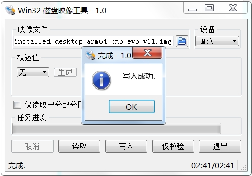
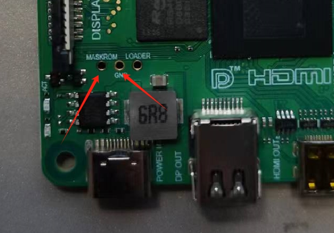
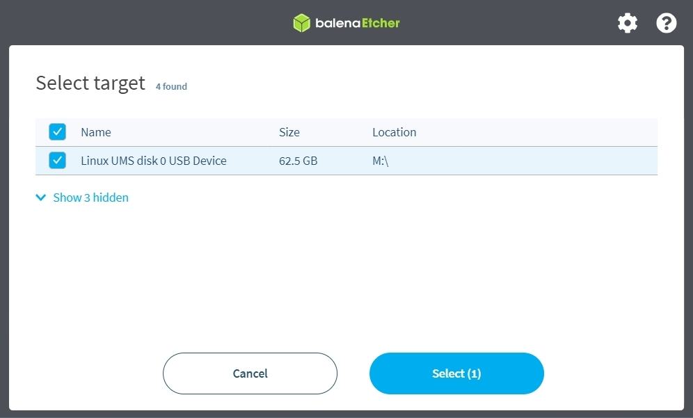
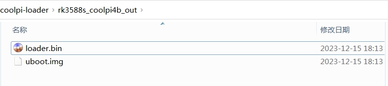

# CP4b Quick Start Guide 

<center></center> 

## Interface Introduction
|  Interface |  Model |  Specifications |
|:-:|:-:|:-:|
| CPU  |  ROCKCHIP RK3588S|  4cores A76(2.2GHz)+4cores A55(1.8GHz) |
|  GPU |  ARM MaliG610 | 4cores（1GHz） |
|  NPU |  ROCKCHIP | 4cores（1GHz） |
|  DDR |  LPDDR4/4X | 2G/4G/8G/16G/32G up to 4266Mbps |
|  HDMI |  HDMI 2.1 | 8KP60 |
|  DP |  DP1.4 2Lens | 4KP60 |
|  Headphone |  Phone+Mic | 2-Channel Stereo |
|  USB2.0 |  4x |Only supports HOST mode and two are connector extensions  |
|  USB3.0 |  2x | The upper layer is an OTG interface |
|  Ethernet |  Gigabit | Support POE |
|  DSI-TX |  2Lens | 4.5Gbps/Line |
|  CSI-RX |  2Lens | 2.5Gbps/Line |
|  WIFI |  WIFI6+BT5.0 |  IEEE 802.11b/g/n/ac/ax |
|  GPIO |  28 |  i2c uart spi can pwm Refer to the following table |
|  KEY |  POWER |  Support user customization|
## Interface View
<center></center> 

## GPIO Extension Interface
|Number|Function0|Function1|Function2|Function3|Function4|Function5|Function6|Function7|Function8|
|:-:|:-:|:-:|:-:|:-:|:-:|:-:|:-:|:-:|:-:|
|<font color=Red>1</font>|<font color=Red>3V3</font>|&nbsp;|&nbsp;|&nbsp;|&nbsp;|&nbsp;|&nbsp;|&nbsp;|&nbsp;|
|3|GPIO0_D5|&nbsp;|I2C1_SDA_M2|&nbsp;|&nbsp;|&nbsp;|CAN2_TX_M1|&nbsp;|&nbsp;|
|5|GPIO0_D4|PWM3_IR_M0|I2C1_SCL_M2|&nbsp;|&nbsp;|&nbsp;|CAN2_RX_M1|&nbsp;|&nbsp;|
|7|GPIO1_B7|&nbsp;|&nbsp;|&nbsp;|SPDIF1_TX_M0|PWM13_M2|&nbsp;|&nbsp;|&nbsp;|
|9|GND|&nbsp;|&nbsp;|&nbsp;|&nbsp;|&nbsp;|&nbsp;|&nbsp;|&nbsp;|
|11|GPIO4_A0|&nbsp;|&nbsp;|I2S1_MCLK_M0|&nbsp;|&nbsp;|&nbsp;|&nbsp;|&nbsp;|
|13|GPIO4_A1|&nbsp;|&nbsp;|I2S1_SCLK_M0|&nbsp;|&nbsp;|&nbsp;|&nbsp;|&nbsp;|
|15|GPIO4_A2|&nbsp;|&nbsp;|I2S1_LRCK_M0|&nbsp;|&nbsp;|&nbsp;|&nbsp;|&nbsp;|
|<font color=Red>17</font>|<font color=Red>3V3</font>|&nbsp;|&nbsp;|&nbsp;|&nbsp;|&nbsp;|&nbsp;|&nbsp;|&nbsp;|
|19|GPIO1_B2| UART4_RX_M2|PDM1_SDI3_M1|&nbsp;|SPI0_MOSI_M2|&nbsp;|&nbsp;|&nbsp;|&nbsp;|
|21|GPIO1_B1| &nbsp;|PDM1_SDI2_M1|&nbsp;|SPI0_MISO_M2|&nbsp;|&nbsp;|&nbsp;|&nbsp;|
|23|GPIO1_B3| UART4_TX_M2|PDM1_CLK1_M1|&nbsp;|SPI0_CLK_M2|&nbsp;|&nbsp;|&nbsp;|&nbsp;|
|25|GND|&nbsp;|&nbsp;|&nbsp;|&nbsp;|&nbsp;|&nbsp;|&nbsp;|&nbsp;|
|27|&nbsp;| &nbsp;|&nbsp;|&nbsp;|I2C6_SDA_M3|&nbsp;|&nbsp;|&nbsp;|&nbsp;|
|29|GPIO4_A3| &nbsp;|&nbsp;|&nbsp;|&nbsp;|UART0_TX_M2|&nbsp;|&nbsp;|&nbsp;|
|31|GPIO4_A4| &nbsp;|&nbsp;|&nbsp;|I2C3_SCL_M2|UART0_RX_M2|&nbsp;|&nbsp;|&nbsp;|
|33|GPIO4_A5| &nbsp;|&nbsp;|I2S1_SDI0_M0|I2C3_SDA_M2|UART3_TX_M2|&nbsp;|&nbsp;|&nbsp;|
|35|GPIO4_A6| &nbsp;|&nbsp;|I2S1_SDI1_M0|I2C5_SCL_M2|UART3_RX_M2|&nbsp;|&nbsp;|&nbsp;|
|37|GPIO4_A7| &nbsp;|&nbsp;|I2S1_SDI2_M0|I2C5_SDA_M2|&nbsp;|&nbsp;|&nbsp;|&nbsp;|
|39|GND|&nbsp;|&nbsp;|&nbsp;|&nbsp;|&nbsp;|&nbsp;|&nbsp;|&nbsp;|
|<font color=Red>2</font>|<font color=Red>5V0</font>|&nbsp;|&nbsp;|&nbsp;|&nbsp;|&nbsp;|&nbsp;|&nbsp;|&nbsp;|
|<font color=Red>4</font>|<font color=Red>5V0</font>|&nbsp;|&nbsp;|&nbsp;|&nbsp;|&nbsp;|&nbsp;|&nbsp;|&nbsp;|
|6|GND|&nbsp;|&nbsp;|&nbsp;|&nbsp;|&nbsp;|&nbsp;|&nbsp;|&nbsp;|
|8|&nbsp;|&nbsp;|&nbsp;|&nbsp;|&nbsp;|&nbsp;|&nbsp;|UART2_TXD|&nbsp;|
|10|&nbsp;|&nbsp;|&nbsp;|&nbsp;|&nbsp;|&nbsp;|&nbsp;|UART2_RXD|&nbsp;|
|12|GPIO1_A7|&nbsp;|PDM1_SDI0_M1|&nbsp;|&nbsp;|PWM3_IR_M3|&nbsp;|&nbsp;|&nbsp;|
|14|GND|&nbsp;|&nbsp;|&nbsp;|&nbsp;|&nbsp;|&nbsp;|&nbsp;|&nbsp;|
|16|GPIO1_A1|UART6_TX_M1|&nbsp;|&nbsp;|&nbsp;|&nbsp;|&nbsp;|&nbsp;|&nbsp;|
|18|GPIO1_A0|UART6_RX_M1|&nbsp;|&nbsp;|&nbsp;|&nbsp;|&nbsp;|&nbsp;|&nbsp;|
|20|GND|&nbsp;|&nbsp;|&nbsp;|&nbsp;|&nbsp;|&nbsp;|&nbsp;|&nbsp;|
|22|GPIO1_B0|&nbsp;|PDM1_SDI1_M1|&nbsp;|&nbsp;|&nbsp;|&nbsp;|&nbsp;|&nbsp;|
|24|GPIO1_B4|UART7_RX_M2|PDM1_CLK0_M1|&nbsp;|SPI0_CS0_M2|&nbsp;|&nbsp;|&nbsp;|&nbsp;|
|26|GPIO1_B5|UART7_TX_M2|&nbsp;|&nbsp;|SPI0_CS1_M2|&nbsp;|&nbsp;|&nbsp;|&nbsp;|
|28|&nbsp;|&nbsp;|&nbsp;|&nbsp;|I2C6_SCL_M3|&nbsp;|&nbsp;|&nbsp;|&nbsp;|
|30|GND|&nbsp;|&nbsp;|&nbsp;|&nbsp;|&nbsp;|&nbsp;|&nbsp;|&nbsp;|
|32|GPIO3_B1|&nbsp;|&nbsp;|&nbsp;|&nbsp;|&nbsp;|MIPI_CAM4_CLK_M1|PWM2_M1|&nbsp;|
|34|GND|&nbsp;|&nbsp;|&nbsp;|&nbsp;|&nbsp;|&nbsp;|&nbsp;|&nbsp;|
|36|GPIO4_B2|&nbsp;|&nbsp;|I2S1_SDO1_M0|&nbsp;|&nbsp;|&nbsp;|PWM14_M1|CAN1_RX_M1|
|38|GPIO4_B3|&nbsp;|&nbsp;|I2S1_SDO2_M0|&nbsp;|&nbsp;|&nbsp;|PWM15_IR_M1|CAN1_TX_M1|
|40|GPIO3_C3|&nbsp;|&nbsp;|&nbsp;|&nbsp;|&nbsp;|&nbsp;|PWM15_IR_M0|&nbsp;|
## Getting Started
### *Preparation of accessories*
+ Cp4b main board
+ One of the Storage media below,Capacity greater than 8GB.
  - TF Card
  - Emmc module
  - USB Flash Disk
+ HDMI/DP interface display
  <!-- <center></center> -->
+ USB Keyboard and Mouse
+ Display cable
  - MICRO HDMI to HDMI wire
  <!-- <center></center> -->

  - MINI DP to DP wire
  <!-- <center></center> -->

  - MINI DP to HDMI wire(Only supports active DP to HDMI cables)
+ TF card reader,If using a USB Flash Disk, there is no need for it.
+ Power adapter 
  - support 5V/3A 9V/2A 12V/1.5A
  - support PD and QC self-adaption
### *Upgrade Firmware*
+ Obtain system image
  - Obtain the official Ubuntu/Debian system image from [*百度网盘*](https://pan.baidu.com/s/1CMBGGhGUMMDpg88-WulGWw?pwd=4rjd#list/path=%2Fsharelink1102153748621-436623026773232%2Fcoolpi%2FCoolPi%204B&parentPath=%2Fsharelink1102153748621-436623026773232)  
  - Obtain the official Ubuntu/Debian system image from [*Onedrive*](https://coolpi-my.sharepoint.com/personal/coolpi_coolpi_onmicrosoft_com/_layouts/15/onedrive.aspx?id=%2Fpersonal%2Fcoolpi%5Fcoolpi%5Fonmicrosoft%5Fcom%2FDocuments%2Fcoolpi&ga=1)
+ Operation steps
  - TF Card: 
    Insert TF card into the card reader, and connect the card reader to the USB interface of the computer.
  - Emmc module:
    Using the EMMC module is a bit more complicated. First, you need to attach the EMMC module to the EMMC TO TF adapter board, then connect the adapter board to the TF card reader, and then connect the reader to the computer.
  - USB Flash Disk: 
    If using a USB disk  as the storage medium, the USB disk is directly connected to the computer.

  
+ Using [*Etcher*]( https://etcher.download/download-etcher/) 
  - In the etcher window, click flash from file.
  
  - In the etcher window, click select target.
  
  - In the etcher window, click Flash.
  
  - In the etcher window, once it shows us Flash 
  Complete! It is done and can be put into the cp4b.
+ Using [*Win32disk imager*]( https://win32diskimager.org/) 
  - In the Win32disk window, click Select image.
  
    
  - In the Win32disk window, click Select Drive.
  
    
  - In the Win32disk window, click Flash.
  
    
  - In the Win32disk window, once it shows us Flash.
   
    
  - Complete! It is done and can be put into the cp4b.
+ Using [*RKdevTool*]( https://etcher.download/download-etcher/) 
  - Short circuit the two pins as shown in the figure below, and then power on the machine to enter maskrom mode.
  
  - One end of the USB cable with dual A-ports is connected to the USB3.0 OTG interface of the machine, and the other end is connected to the PC, as shown in the following figure. The tool recognizes the maskrom device.
  
  - Select the loader and system image file, then select force write by address, and finally click run.
  
  - After the image download is completed, the machine will automatically restart.
  
+ Using *USB-UMS mode*
  - Only the EMMC module is supported.
  - CP4b connects the USB 3.0 OTG interface between the PC and the machine through dual A-type USB cables, connects the power, and quickly presses the power button 5 times to enter UMS mode. This is a "system-boot" icon that will appear on the computer, and you can use Etcher or win32diskimager software to burn the system image. Actually, it's about virtualizing the machine as a usb disk.
  - <font color=Red>*If CP4b uses EMMC modules as storage media, it is strongly recommended to use UMS mode for development, which can avoid plugging and unplugging EMMC small boards and reduce the risk of small board connector damage.*</font>
     
## Compile kernel source code
  + To build a code compilation environment, you can use various Linux distributions to compile the CP4B kernel source code, such as Ubuntu, Debian, etc. The documentation uses Ubuntu 22.04 as an example for explanation.
  + Both virtual and physical machines are possible.You can also directly compile the kernel source code on cp4b.
  + Use the following command to obtain the cp4b kernel source code.
    
    ```
    git clone https://github.com/yanyitech/coolpi-kernel.git 
    cd coolpi-kernel
     ./build-kernel.sh cp4b
    ```
## Update cp4b kernel
  + After compiling the root directory of the kernel source code, an out directory will be generated. The following methods can be used to update the kernel:
  + Copy the out folder to a USB drive, then insert any USB interface of cp4b, and copy all files from the out directory to the machine/boot/firmware directory. Then extract the modules.tar.gz file to the machine/lib directory.
    ```
    cp out/* /boot/firmware/ -R
    sudo tar -zxvf /boot/firmware/modules.  tar.gz -C /lib  
    ```
  + The cp4b machine establishes a Samba shared directory, copies the out directory to the corresponding cp4b directory through the network, and then decompresses modules.tar.gz to the lib directory.
    ```
    sudo apt update
    sudo apt install samba
    mkdir /home/coolpi/share
    chmod -R 755 /home/coolpi/share
    sudo vim /etc/samba/smb.conf
    *Add the following code at the end of the file*
    [Share]
    comment = Shared Folder
    path = /home/coolpi/share
    browseable = yes
    read only = no
    guest ok = yes
    create mask = 0755
    directory mask = 0755
    sudo service smbd restart
    ```
  + The cp4b machine enters UMS mode, and then A drive letter named "system boot" will appear on the computer. It directly copies all files from the out directory to the system-boot, restarts cp4b, and then unzips module.tar.gz to the lib directory.
  

## Compile uboot source code
+ Use the following command to obtain and build the cp4b uboot source code.
  ```
  git clone https://github.com/yanyitech/coolpi-loader.git
  cd coolpi-loader
  ./build-uboot.sh cp4b
  ```
+ After compilation, the root directory of the code will generate rk3588s_ Coolpi4b_out folder contains two files: loader.bin and uboot.img.
  
## Update cp4 uboot
+ Short circuit the maskrom and gnd test points, enter the maskrom mode of the machine, select the loader and uboot file paths, select the storage medium SPINOR, check the write by address, and then click run.
  
## Expansion interface function testing

+ Using gpio sysfs to read and write io
    - In Linux, the most common way to read and write gpio is to use the gpio sysfs interface, which is achieved by operating files such as export, unexport, gpio {N}/direction, and gpio {N}/value (replacing {N} with actual pin numbers) in the/sys/class/gpio directory, and often appears in shell scripts. For example, controlling GPIO4_A0(128) of cp4b in a shell:
      ```
      sudo su
      cd /sys/class/gpio
      echo 128 > export
      echo out > gpio128/direction       # io used for output
      echo 1 > gpio128/value             # output logic 1 level
      echo 0 > gpio128/value             # output logic 0 level
      echo 128 > unexport
      ```
    - The gpio sysfs interface is currently widely used, but there are some issues, such as the inability to concurrently obtain sysfs properties and the basic design of interfaces for shells. So starting from Linux 4.8, gpiod replaced it.
      ```
      Since linux 4.8 the GPIO sysfs interface is deprecated. User space should use 
      the character device instead. This library encapsulates the ioctl calls and 
      data structures behind a straightforward API.
      ```
+ Using libgpiod to read and write gpio
  - The new design gpiod, gpio access control is achieved by manipulating character device files (such as/dev/gpiodchip0), and provides command tools, C libraries, and Python encapsulation through libgpiod.
  - Through the gpioset, gpioget, and gpiomon provided by libgpiod, GPIO can be quickly read and written, and input events can be detected.
  - Install the package for gpiod
    ```
    sudo apt install -y gpiod  
    ```
  - List gpio groups for cp4b 
    ```   
    sudo gpiodetect                
    gpiochip0 [gpio0] (32 lines)
    gpiochip1 [gpio1] (32 lines)
    gpiochip2 [gpio2] (32 lines)
    gpiochip3 [gpio3] (32 lines)
    gpiochip4 [gpio4] (32 lines)
    gpiochip5 [rk806-gpio] (3 lines)
    ```
  - List detailed information about group 4
    ```
    sudo gpioinfo 4                
    gpiochip4 - 32 lines:
          line   0:      unnamed       unused   input  active-high 
          line   1:      unnamed       unused   input  active-high 
          line   2:      unnamed       unused   input  active-high 
          line   3:      unnamed       unused   input  active-high 
          line   4:      unnamed       unused   input  active-high 
          line   5:      unnamed       unused   input  active-high 
          line   6:      unnamed       unused   input  active-high 
          line   7:      unnamed       unused   input  active-high 
          line   8:      unnamed       unused   input  active-high 
          line   9:      unnamed       unused   input  active-high 
          line  10:      unnamed       unused   input  active-high 
          line  11:      unnamed       unused   input  active-high 
          line  12:      unnamed       unused   input  active-high 
          line  13:      unnamed       unused   input  active-high 
          line  14:      unnamed     "enable"  output  active-high [used]
          line  15:      unnamed       unused   input  active-high 
          line  16:      unnamed       unused   input  active-high 
          line  17:      unnamed       unused   input  active-high 
          line  18:      unnamed       unused   input  active-high 
          line  19:      unnamed       unused   input  active-high 
          line  20:      unnamed       unused   input  active-high 
          line  21:      unnamed       unused   input  active-high 
          line  22:      unnamed       unused   input  active-high 
          line  23:      unnamed       unused   input  active-high 
          line  24:      unnamed       unused   input  active-high 
          line  25:      unnamed       unused   input  active-high 
          line  26:      unnamed       unused   input  active-high 
          line  27:      unnamed       unused   input  active-high 
          line  28:      unnamed       unused   input  active-high 
          line  29:      unnamed       unused   input  active-high 
          line  30:      unnamed       unused   input  active-high 
          line  31:      unnamed       unused   input  active-high 
    ```

  - Operate GPIO4_A0 to output high or low levels
    ```
    sudo gpioset 4 0=1           # output logic 1 level
    sudo gpioset 4 0=0           # output logic 0 level
    ```
  - Get GPIO4_ A0 level
    ```
    sudo gpioget 4 0
    0                            # Read the value of GPIO4_A0 is 0
    ```
  - The correspondence between commands and GPIO
    For example：GPIO3_C3 ,GPIO3 represents GPIO group 3,C3 is the 19th(8*2+3) GPIO in this group.Therefore, the operation command of GPIO is:
    ```
    sudo gpioset 3 19=1           # output logic 1 level
    sudo gpioset 3 19=0           # output logic 0 level
    ```
  - *Using sysfs or gpiod, both are GPIO encapsulated interfaces using Linux. After encapsulation, the versatility is improved, but the performance may weaken. If you have studied 51 and ARM microcontrollers, the most familiar way to read and write GPIO is probably to directly operate the GPIO register, which is the fastest way to control the IO port. In Linux, you can also directly operate the GPIO register.*  
+ Operation register controls gpio
  - In Linux, to directly read and write physical addresses, first open the device file/dev/mem, then use mmap to map the file, and finally read and write the corresponding registers based on the register address.
  - You can use devmem2 to read and write physical memory addresses. If you cannot aptly install devmem2, you can https://github.com/vctlabs/devmem2 Download and compile a copy. 
    ```
    sudo apt install devmem2
    ```
  - The base addresses of 5 groups of GPIO registers
  
    |Name|Address|Size|
    |:-:|:-:|:-:|
    |GPIO0 |FD8A0000 |64KB|
    |GPIO1 |FEC20000 |64KB|
    |GPIO2 |FEC30000 |64KB|
    |GPIO3 |FEC40000 |64KB|
    |GPIO4 |FEC50000 |64KB|

  - Offset address corresponding to GPIO related registers
    |Name|Address|Size|Reset Value|Description|
    |:-:|:-:|:-:|:-:|:-:|
    |GPIO_SWPORT_DR_L |0x0000| W |0x00000000 |Port Data Register (Low)|
    |GPIO_SWPORT_DR_H |0x0004| W |0x00000000 |Port Data Register (High)|
    |GPIO_SWPORT_DDR_L |0x0008| W |0x00000000 |Port Data Direction Register (Low)|
    |GPIO_SWPORT_DDR_H |0x000C| W |0x00000000 |Port Data Direction Register(High)|
    |GPIO_EXT_PORT| 0x0070| W |0x00000000| External Port Data Register|

  - Register Operation GPIO4_ A0
  0xFEC50000 is the base address of GPIO4.
  0x0008 is an input-output register, where the top 15 bits are write enable bits, the bottom 16 bits are corresponding GPIO input-output properties, 1 represents output, and 0 represents input. 
  0x0000 is a high-level offset register, where 1 represents high level and 0 represents low level.
  0x0070 is an input level offset register with a total of 32 bits, representing 32 GPIO states. 1 represents the input high level, and 0 represents the input low level.


    ```

    devmem2 0xFEC50008 w 0x00010001   #GPIO4_ A0 configured as output mode
    devmem2 0xFEC50000 w 0x00010001   #GPIO4_ A0 output high level
    devmem2 0xFEC50000 w 0x00010000   #GPIO4_ A0 output low level

    devmem2 0xFEC50008 w 0x00010000   #GPIO4_ A0 configured as input mode
    devmem2 0xFEC50070                #Get GPIO4_ A0 level
    /dev/mem opened.
    Memory mapped at address 0x7f86c81000.
    Value at address 0xFEC50070 (0x7f86c81070): 0x1F03EF00  #GPIO4_ A0 input value is 0
    ```

+ Operating the uart of the machine
  - The following table lists the pins of the 40PIN connector that can be used for UART function. Currently, in addition to debugging the serial port, it can also be extended to 5 independent serial ports. The maximum baud rate is 1.5M. The IO level is TTL 3.3V. Note: The serial port number does not correspond one-to-one with the actual system node, and actual operation needs to follow the corresponding device node in the table.
  
    Serial Number | Definition | Describe | IO Level | Device Node|
    :-:|:-:|:-:|:-:|:-:|
    29 | UART0_TX_M2 |UART0 TXD| TTL 3.3V | /dev/ttyS6
    31 | UART0_RX_M2 |UART0 RXD| TTL 3.3V | /dev/ttyS6
    33 | UART3_TX_M2 |UART3 TXD| TTL 3.3V | /dev/ttyS3
    35 | UART3_RX_M2 |UART3 RXD| TTL 3.3V | /dev/ttyS3
    23 | UART4_TX_M2 |UART4 TXD| TTL 3.3V | /dev/ttyS4
    19 | UART4_RX_M2 |UART4 RXD| TTL 3.3V | /dev/ttyS4
    16 | UART6_TX_M1 |UART6 TXD| TTL 3.3V | /dev/ttyS2
    18 | UART6_RX_M1 |UART6 RXD| TTL 3.3V | /dev/ttyS2
    26 | UART7_TX_M2 |UART7 TXD| TTL 3.3V | /dev/ttyS7
    24 | UART7_RX_M2 |UART7 RXD| TTL 3.3V | /dev/ttyS7

  - DTS configuration
    Configure the required serial port node properties to okay in DTS, recompile the kernel to generate a dtb file, and then replace the file in the /boot/firmware directory of the cp4b machine.
    ```
    &uart0 {
      pinctrl-names = "default";
      pinctrl-0 = <&uart0m2_xfer>;
      status = "okay";
    };

    &uart3 {
      pinctrl-names = "default";
      pinctrl-0 = <&uart3m2_xfer>;
      status = "okay";
    };

    &uart4 {
      pinctrl-names = "default";
      pinctrl-0 = <&uart4m2_xfer>;
      status = "okay";
    };

    &uart6 {
      pinctrl-names = "default";
      pinctrl-0 = <&uart6m1_xfer>;
      status = "okay";
    };

    &uart7 {
      pinctrl-names = "default";
      pinctrl-0 = <&uart7m2_xfer>;
      status = "okay";
    };
    ```
  - Test Command
    ```
    stty -F /dev/ttyS6 raw speed 115200             # Configure the serial port baud rate corresponding to PIN29 and PIN31 to be 115200
    echo "hello coolpi" > /dev/ttyS6                # Send string   
    cat /dev/ttyS6                                  # Receive string
    ```
+ Operating the i2c of the machine
  - As shown in the table below, the 40PIN connector of coolpi 4b can lead out four sets of I2C buses. Among them, I2C1, I2C3, and I2C5 are independent I2C interfaces, which are not multiplexed with other devices inside the machine. The I2C6 board has an RTC clock chip HYM8563 connected to it, with an address of 51H. Therefore, when using the I2C6 port for external devices, be careful not to conflict addresses.
  
    Serial Number | Port Definition | Describe | Io Status  
    :-:|:-:|:-:|:-:
    3  | I2C1_SDA_M2 |I2C1 SDA| Internal 2.2K Pull up 3.3V 
    5  | I2C1_SCL_M2 |I2C1 SCL| Internal 2.2K Pull up 3.3V 
    33 | I2C3_SDA_M2 |I2C3 SDA| Internal 2.2K Pull up 3.3V
    31 | I2C3_SCL_M2 |I2C3 SCL| Internal 2.2K Pull up 3.3V 
    37 | I2C5_SDA_M2 |I2C5 SDA| Internal 2.2K Pull up 3.3V
    35 | I2C5_SCL_M2 |I2C5 SCL| Internal 2.2K Pull up 3.3V 
    27 | I2C6_SDA_M3 |I2C6 SDA| Internal 2.2K Pull up 3.3V 
    28 | I2C6_SCL_M3 |I2C6 SCL| Internal 2.2K Pull up 3.3V 

  - DTS configuration
    The configuration method of the device driver should refer to the I2C6 node, and be careful not to use the I2C function to ensure that the node's status is disabled, otherwise it may cause other functional abnormalities.
    After modifying the dts file, the kernel needs to be recompiled and the newly generated dtb file needs to be replaced in the cp4b /boot/firmware directory.
    ```
    &i2c1 {
      status = "okay";
      pinctrl-names = "default";
      pinctrl-0 = <&i2c1m2_xfer>;
    };

    &i2c3 {
      status = "okay";
      pinctrl-names = "default";
      pinctrl-0 = <&i2c3m2_xfer>;
    };

    &i2c5 {
      status = "okay";
      pinctrl-names = "default";
      pinctrl-0 = <&i2c5m2_xfer>;
    };

    &i2c6 {
      status = "okay";
      pinctrl-names = "default";
      pinctrl-0 = <&i2c6m3_xfer>;

      hym8563: hym8563@51 {
        compatible = "haoyu,hym8563";
        reg = <0x51>;
        #clock-cells = <0>;
        clock-frequency = <32768>;
        clock-output-names = "hym8563";
        pinctrl-names = "default";
        pinctrl-0 = <&hym8563_int>;
        interrupt-parent = <&gpio0>;
        interrupts = <RK_PB0 IRQ_TYPE_LEVEL_LOW>;
        status = "okay";
      };
    };
    ```
  - Test Command
    ```
    git clone git://git.kernel.org/pub/scm/utils/i2c-tools/i2c-tools.git
    cd i2c-tools
    make -j8
    sudo make install
    root@ubuntu:/# i2cdetect -y 6
        0  1  2  3  4  5  6  7  8  9  a  b  c  d  e  f
    00:                         -- -- -- -- -- -- -- -- 
    10: -- -- -- -- -- -- -- -- -- -- -- -- -- -- -- -- 
    20: -- -- -- -- -- -- -- -- -- -- -- -- -- -- -- -- 
    30: -- -- -- -- -- -- -- -- -- -- -- -- -- -- -- -- 
    40: -- -- -- -- -- -- -- -- -- -- -- -- -- -- -- -- 
    50: -- UU -- -- -- -- -- -- -- -- -- -- -- -- -- -- 
    60: -- -- -- -- -- -- -- -- -- -- -- -- -- -- -- -- 
    70: -- -- -- -- -- -- -- --
    ```
+ Operating the spi of the machine
  - The serial number of the SPI interface corresponding to the 40PIN connector.

    Serial Number | Port Definition | Describe | Io Status 
    :-:|:-:|:-:|:-:
    19 | SPI0_MOSI_M2 |MOSI| Internal 2.2K Pull up 3.3V 
    21 | SPI0_MISO_M2 |MISO| Internal 2.2K Pull up 3.3V 
    23 | SPI0_CLK_M2 |CLK| Internal 2.2K Pull up 3.3V
    24 | SPI0_CS0_M2 |CS0| Internal 2.2K Pull up 3.3V 
    26 | SPI0_CS1_M2 |CS1| Internal 2.2K Pull up 3.3V
  - DTS Configuration
    ```
    &spi0 {
      pinctrl-names = "default";
      status = "okay";
      max-freq = <48000000>; /* spi internal clk, don't modify */
            spi_dev@0 {
                    compatible = "rockchip,spidev";
                    reg = <0>;
                    spi-max-frequency = <12000000>;
                    spi-lsb-first;
            };

            spi_dev@1 {
                    compatible = "rockchip,spidev";
                    reg = <1>;
                    spi-max-frequency = <12000000>;
                    spi-lsb-first;
            };
    };
    ```
  - Test Command
    Loopback test requires short circuiting of pins 19 and 21
    ```
    sudo apt-get install spi-tools                                          # Install tool software

    spi-config -d /dev/spidev0.0 -q                                         # Confirm the configuration of option 0
    /dev/spidev0.0: mode=0, lsb=0, bits=8, speed=12000000, spiready=0
    
    spi-config -d /dev/spidev0.1 -q                                         # Confirm the configuration of option 1
    /dev/spidev0.1: mode=0, lsb=0, bits=8, speed=12000000, spiready=0
     
    printf 'hello coolpi!' | spi-pipe -d /dev/spidev0.0 | hexdump -C        # Send string
    00000000  68 65 6c 6c 6f 20 63 6f  6f 6c 70 69 21           |hello coolpi!|
    0000000d  
    ```
+ Operating the pwm of the machine
  - The serial number of the pwm interface corresponding to the 40PIN connector.
    Serial Number | Port Definition | Describe | Io Status  
    :-:|:-:|:-:|:-:
    5 | PWM3_IR_M0 |PWM3| Internal 10K Pull up 3.3V 
    7 | PWM13_M2 |PWM13| Internal 47K Pull up 3.3V 
    12 | PWM3_IR_M3 |PWM3| Internal 47K Pull up 3.3V
    32 | PWM2_M1 |PWM2| Internal 10K Pull up 3.3V 
    36 | PWM14_M1 |PWM14| Internal 2.2K Pull up 3.3V
    38 | PWM15_IR_M1 |PWM15| Internal 2.2K Pull up 3.3V 
    40 | PWM15_IR_M0 |PWM15| Internal 2.2K Pull up 3.3V
  - DTS Configuration
    Taking PWM3 as an example, first configure PWM enable in DTS, and then fill in the corresponding pins, as shown in the following figure, pinctrl needs to be configured. Then the status changes to okay.
    ```
    &pwm3 {
      pinctrl-0 = <&pwm3m3_pins>;
      status = "okay";
    };
    ```
  - Test Command  
  PWM provides an interface for the application layer. Under the/sys/class/PWM/node, after the PWM driver is successfully loaded, the PWM chip0 directory will be generated in the/sys/class/PWM/directory. If DTS is configured with multiple PWM controllers, multiple PWM chip nodes will be generated, and the names of the nodes will be determined by the registration order of the PWM controllers in the DTS file. Writing 0 to the export file opens the PWM timer 0, which will generate a PWM 0 directory. Conversely, writing 0 to Unexport will close the PWM timer, and the PWM 0 directory will be deleted. There are several files in this directory:
    ```
    root@Ubuntu:/sys/class/pwm# ls
    pwmchip0  pwmchip1  pwmchip2
    root@Ubuntu:/sys/class/pwm# cd pwmchip1
    root@Ubuntu:/sys/class/pwm/pwmchip1# ls
    device  export  npwm  power  subsystem  uevent  unexport
    root@Ubuntu:/sys/class/pwm/pwmchip1# echo 0 >export 
    root@Ubuntu:/sys/class/pwm/pwmchip1# ls
    device  export  npwm  power  pwm0  subsystem  uevent  unexport
    root@Ubuntu:/sys/class/pwm/pwmchip1# cd pwm0/
    root@Ubuntu:/sys/class/pwm/pwmchip1/pwm0# ls
    capture  duty_cycle  enable  output_type  period  polarity  power  uevent
    ```
  - enable: write 1 to enable pwm, write 0 to disable pwm;
  - polarity: there are two parameter options, normal or reversed, indicating the flipping of the output pin level;
  - duty_ cycle: in normal mode, the duration of high level in one cycle (in nanoseconds), and in reversed mode, the duration of low level in one cycle (in nanoseconds);
  - period: the period of the PWM wave (in nanoseconds);
  - oneshot_ count: represents the number of PWM waveforms in one shot mode, and the value cannot exceed 255;
  - The following is an example of pwmchip1. Set the pwm0 output frequency to 100K, duty cycle to 50%, polarity to positive, and output in Continuous mode:
    ```
    cd /sys/class/pwm/pwmchip1/
    echo 0 > export
    cd pwm0
    echo 10000 > period
    echo 5000 > duty_cycle
    echo normal > polarity
    echo 1 > enable
    ```
+ Operating the can bus of the machine
  - The serial number of the can interface corresponding to the 40PIN connector.

    Serial Number | Port Definition | Describe | Io Status 
    :-:|:-:|:-:|:-:
    3 | CAN2_TX_M1 |TXD| Internal 10K Pull up 3.3V 
    5 | CAN2_RX_M1 |RXD| Internal 10K Pull up 3.3V 
    38 | CAN1_TX_M1 |TXD| Internal 47K Pull up 3.3V 
    36 | CAN1_RX_M1 |RXD| Internal 47K Pull up 3.3V
  - The output of cp4b is the CAN signal of TTL. If normal communication is required, an interface conversion board needs to be added to convert the TTL signal into CANH CANL standard signal. The conversion circuit diagram is shown below:
  
  <center></center> 

  - DTS Configuration
    The CAN2 interface and I2C1 are multiplexed, and if you want to use the CAN2 function, I2C1 must be turned off.The I2C1 attribute shown in the figure is configured as disabled, and the two CAN nodes are configured as okay.
    ```
    &i2c1 {
      status = "disabled";
      pinctrl-names = "default";
      pinctrl-0 = <&i2c1m2_xfer>;
    };

    &can1 {
      pinctrl-names = "default";
      pinctrl-0 = <&can1m1_pins>;
      status = "okay";
    };

    &can2 {
      pinctrl-names = "default";
      pinctrl-0 = <&can2m1_pins>;
      status = "okay";
    };
    ```
  - Test Command 
  Canutils is a commonly used CAN communication testing tool package, which contains 5 unique programs: canconfig, candump, canecho, cansend, cansequence. The function description of this program is as follows:
  *canconfig*
   The parameters used to configure the CAN bus interface mainly include baud rate and mode.
  *candump*
   Receive data from the CAN bus interface and print it in hexadecimal format to standard output, or output it to a specified file.
  *canecho*
   Resend all data received from the CAN bus interface to the CAN bus interface.
  *cansend*
  Send the specified data to the specified CAN bus interface.
  *cansequence*
   Automatically increment the number to the specified CAN bus interface, or specify the receiving mode and verify the received increment number.
  *ip*
   CAN baud rate, functionality, and other configurations.
  *Note: Busybox also integrates IP tools, but the version in Busybox is a castration version. CAN operation is not supported. Please confirm the version of the IP command (iproute 2) before using it.*
  - CAN normal command interface
   Query current network devices:
    ```
    ifconfig -a
    ``` 
    CAN stop:
    ```
    ip link set can0 down
    ``` 
    Set the baud rate to 500KHz:
    ```
    ip link set can0 type can bitrate 500000
    ``` 
    Print can0 information:
    ```
    ip -details -statistics link show can0
    ```
    CAN start:
    ```
    ip link set can0 up
    ``` 
    CAN sending:
    Send (standard frame, data frame, ID: 123, date: DEADBEEF):
    ```
    cansend can0 123#DEADBEEF
    ```
    Send (standard frame, remote frame, ID: 123):
    ```
    cansend can0 123#R
    ```
    Send (Extended frame, Data frame, ID: 0000123, date: DEADBEEF):
    ```
    cansend can0 00000123#12345678
    ```
    Send (Extended frame, Remote frame, ID: 0000123):
    ```
    cansend can0 00000123#R
    ```
    CAN reception:
    Start printing and wait for reception:
    ```
    candump can0
    ```

## General functional testing
  + Ethernet performance testing
    - CP4b installation testing tool
      ```
      sudo apt-get install iperf3
      ``` 
    - PC installation testing tool
      https://iperf.fr/iperf-download.php
    - cp4b as the server and PC  as the client
      ```
      coolpi@Ubuntu:~$ iperf3 -s -i 1 -p 1314
      -----------------------------------------------------------
      Server listening on 1314
      -----------------------------------------------------------
      Accepted connection from 192.16.19.24, port 52777
      [  5] local 192.16.19.233 port 1314 connected to 192.16.19.24 port 52778
      [ ID] Interval           Transfer     Bitrate
      [  5]   0.00-1.00   sec  89.6 MBytes   751 Mbits/sec                  
      [  5]   1.00-2.00   sec   112 MBytes   937 Mbits/sec                  
      [  5]   2.00-3.00   sec   112 MBytes   942 Mbits/sec                  
      [  5]   3.00-4.00   sec   112 MBytes   940 Mbits/sec                  
      [  5]   4.00-5.00   sec   112 MBytes   942 Mbits/sec                  
      [  5]   5.00-6.00   sec   112 MBytes   942 Mbits/sec                  
      [  5]   6.00-7.00   sec   112 MBytes   942 Mbits/sec                  
      [  5]   7.00-8.00   sec   112 MBytes   942 Mbits/sec                  
      [  5]   8.00-9.00   sec   112 MBytes   942 Mbits/sec                  
      [  5]   9.00-10.00  sec   112 MBytes   942 Mbits/sec                  
      [  5]  10.00-11.00  sec   112 MBytes   942 Mbits/sec                  
      [  5]  11.00-12.00  sec   112 MBytes   942 Mbits/sec                  
      [  5]  12.00-13.00  sec   112 MBytes   942 Mbits/sec                  
      [  5]  13.00-14.00  sec   112 MBytes   941 Mbits/sec                  
      [  5]  14.00-15.00  sec   112 MBytes   942 Mbits/sec                  
      [  5]  15.00-16.00  sec   112 MBytes   942 Mbits/sec                  
      [  5]  16.00-17.00  sec   112 MBytes   942 Mbits/sec                  
      [  5]  17.00-18.00  sec   112 MBytes   942 Mbits/sec                  
      [  5]  18.00-19.00  sec   112 MBytes   942 Mbits/sec                  
      [  5]  19.00-20.00  sec   112 MBytes   940 Mbits/sec                  
      [  5]  20.00-20.20  sec  22.6 MBytes   942 Mbits/sec                  
      - - - - - - - - - - - - - - - - - - - - - - - - -
      [ ID] Interval           Transfer     Bitrate
      [  5]   0.00-20.20  sec  2.19 GBytes   932 Mbits/sec                  receiver
      -----------------------------------------------------------
      Server listening on 1314
      -----------------------------------------------------------
      ``` 
      ```
      C:\iperf-3.1.3-win64>iperf3 -c 192.16.19.233 -i 1 -t 20 -p 1314
      Connecting to host 192.16.19.233, port 1314
      [  4] local 192.16.19.24 port 52717 connected to 192.16.19.233 port 1314
      [ ID] Interval           Transfer     Bandwidth
      [  4]   0.00-1.00   sec   112 MBytes   943 Mbits/sec
      [  4]   1.00-2.00   sec   112 MBytes   942 Mbits/sec
      [  4]   2.00-3.00   sec   112 MBytes   943 Mbits/sec
      [  4]   3.00-4.00   sec   112 MBytes   942 Mbits/sec
      [  4]   4.00-5.00   sec   112 MBytes   942 Mbits/sec
      [  4]   5.00-6.00   sec   112 MBytes   942 Mbits/sec
      [  4]   6.00-7.00   sec   112 MBytes   941 Mbits/sec
      [  4]   7.00-8.00   sec   112 MBytes   942 Mbits/sec
      [  4]   8.00-9.00   sec   112 MBytes   943 Mbits/sec
      [  4]   9.00-10.00  sec   112 MBytes   942 Mbits/sec
      [  4]  10.00-11.00  sec   112 MBytes   942 Mbits/sec
      [  4]  11.00-12.00  sec   112 MBytes   943 Mbits/sec
      [  4]  12.00-13.00  sec   112 MBytes   942 Mbits/sec
      [  4]  13.00-14.00  sec   112 MBytes   942 Mbits/sec
      [  4]  14.00-15.00  sec   112 MBytes   942 Mbits/sec
      [  4]  15.00-16.00  sec   112 MBytes   942 Mbits/sec
      [  4]  16.00-17.00  sec   112 MBytes   942 Mbits/sec
      [  4]  17.00-18.00  sec   112 MBytes   943 Mbits/sec
      [  4]  18.00-19.00  sec   112 MBytes   942 Mbits/sec
      [  4]  19.00-20.00  sec   112 MBytes   943 Mbits/sec
      - - - - - - - - - - - - - - - - - - - - - - - - -
      [ ID] Interval           Transfer     Bandwidth
      [  4]   0.00-20.00  sec  2.19 GBytes   942 Mbits/sec                  sender
      [  4]   0.00-20.00  sec  2.19 GBytes   942 Mbits/sec                  receiver

      iperf Done.
      ``` 
    - PC as the server and cp4b as the client  
      ```
      C:\iperf-3.1.3-win64>iperf3 -s -i 1 -p 1314
      -----------------------------------------------------------
      Server listening on 1314
      -----------------------------------------------------------
      Accepted connection from 192.16.19.233, port 49936
      [  5] local 192.16.19.24 port 1314 connected to 192.16.19.233 port 49938
      [ ID] Interval           Transfer     Bandwidth
      [  5]   0.00-1.00   sec   111 MBytes   931 Mbits/sec
      [  5]   1.00-2.00   sec   110 MBytes   919 Mbits/sec
      [  5]   2.00-3.00   sec   112 MBytes   939 Mbits/sec
      [  5]   3.00-4.00   sec   112 MBytes   939 Mbits/sec
      [  5]   4.00-5.00   sec   111 MBytes   927 Mbits/sec
      [  5]   5.00-6.00   sec   112 MBytes   937 Mbits/sec
      [  5]   6.00-7.00   sec   111 MBytes   931 Mbits/sec
      [  5]   7.00-8.00   sec   112 MBytes   941 Mbits/sec
      [  5]   8.00-9.00   sec   112 MBytes   941 Mbits/sec
      [  5]   9.00-10.00  sec   112 MBytes   941 Mbits/sec
      [  5]  10.00-11.00  sec   112 MBytes   941 Mbits/sec
      [  5]  11.00-12.00  sec   112 MBytes   941 Mbits/sec
      [  5]  12.00-13.00  sec   112 MBytes   938 Mbits/sec
      [  5]  13.00-14.00  sec   112 MBytes   941 Mbits/sec
      [  5]  14.00-15.00  sec   112 MBytes   942 Mbits/sec
      [  5]  15.00-16.00  sec   112 MBytes   941 Mbits/sec
      [  5]  16.00-17.00  sec   112 MBytes   942 Mbits/sec
      [  5]  17.00-18.00  sec   112 MBytes   941 Mbits/sec
      [  5]  18.00-19.00  sec   112 MBytes   941 Mbits/sec
      [  5]  19.00-20.00  sec   112 MBytes   942 Mbits/sec
      [  5]  20.00-20.00  sec   232 KBytes   950 Mbits/sec
      - - - - - - - - - - - - - - - - - - - - - - - - -
      [ ID] Interval           Transfer     Bandwidth
      [  5]   0.00-20.00  sec  0.00 Bytes  0.00 bits/sec                  sender
      [  5]   0.00-20.00  sec  2.18 GBytes   938 Mbits/sec                  receiver
      -----------------------------------------------------------
      Server listening on 1314
      -----------------------------------------------------------
      ``` 
      ```
      coolpi@Ubuntu:~$ iperf3 -c 192.16.19.24 -i 1 -t 20 -p 1314 
      Connecting to host 192.16.19.24, port 1314
      [  5] local 192.16.19.233 port 49938 connected to 192.16.19.24 port 1314
      [ ID] Interval           Transfer     Bitrate         Retr  Cwnd
      [  5]   0.00-1.00   sec   112 MBytes   940 Mbits/sec    0    211 KBytes       
      [  5]   1.00-2.00   sec   110 MBytes   920 Mbits/sec    0    211 KBytes       
      [  5]   2.00-3.00   sec   112 MBytes   938 Mbits/sec    0    211 KBytes       
      [  5]   3.00-4.00   sec   112 MBytes   939 Mbits/sec    0    211 KBytes       
      [  5]   4.00-5.00   sec   110 MBytes   924 Mbits/sec    0    211 KBytes       
      [  5]   5.00-6.00   sec   112 MBytes   936 Mbits/sec    0    211 KBytes       
      [  5]   6.00-7.00   sec   111 MBytes   931 Mbits/sec    0    211 KBytes       
      [  5]   7.00-8.00   sec   112 MBytes   943 Mbits/sec    0    211 KBytes       
      [  5]   8.00-9.00   sec   112 MBytes   941 Mbits/sec    0    211 KBytes       
      [  5]   9.00-10.00  sec   112 MBytes   942 Mbits/sec    0    211 KBytes       
      [  5]  10.00-11.00  sec   112 MBytes   940 Mbits/sec    0    211 KBytes       
      [  5]  11.00-12.00  sec   112 MBytes   941 Mbits/sec    0    211 KBytes       
      [  5]  12.00-13.00  sec   112 MBytes   936 Mbits/sec    0    211 KBytes       
      [  5]  13.00-14.00  sec   113 MBytes   944 Mbits/sec    0    211 KBytes       
      [  5]  14.00-15.00  sec   112 MBytes   939 Mbits/sec    0    211 KBytes       
      [  5]  15.00-16.00  sec   112 MBytes   940 Mbits/sec    0    211 KBytes       
      [  5]  16.00-17.00  sec   113 MBytes   945 Mbits/sec    0    211 KBytes       
      [  5]  17.00-18.00  sec   112 MBytes   940 Mbits/sec    0    211 KBytes       
      [  5]  18.00-19.00  sec   112 MBytes   940 Mbits/sec    0    211 KBytes       
      [  5]  19.00-20.00  sec   112 MBytes   940 Mbits/sec    0    211 KBytes       
      - - - - - - - - - - - - - - - - - - - - - - - - -
      [ ID] Interval           Transfer     Bitrate         Retr
      [  5]   0.00-20.00  sec  2.18 GBytes   938 Mbits/sec    0             sender
      [  5]   0.00-20.00  sec  2.18 GBytes   938 Mbits/sec                  receiver

      iperf Done.
      ```
  + Audio testing
    - View system sound card
      ```
      coolpi@Ubuntu:~$ cat /proc/asound/devices
      1:        : sequencer
      2: [ 0- 0]: digital audio playback
      3: [ 0]   : control
      4: [ 1- 0]: digital audio playback
      5: [ 1- 0]: digital audio capture
      6: [ 1]   : control
      7: [ 2- 0]: digital audio playback
      8: [ 2]   : control
      33:        : timer
      ```
    - Sound recording
  ```sudo arecord -D hw:1,0 -d 10 -f cd -r 44100 -c 2 -t wav test.wav```
    - Sound playing
  ```sudo aplay -D hw:2,0 test.wav```

  + MIPI interface screen
    - LCD interface signal definition 
      The LCD interface of cp4b is fully compatible with Raspberry Pi, so all LCD modules that Raspberry Pi can use can support it.
      Due to the lack of dedicated interrupt pins defined in the interface, the current touch screen only supports scanning mode. For high-resolution LCDs, there may be response speed issues. In this case, it is recommended to use a USB interface touch screen.
  
      <style type="text/css">
        .tg  {border-collapse:collapse;border-spacing:0;}
        .tg td{border-color:black;border-style:solid;border-width:1px;font-family:Arial, sans-serif;font-size:14px;
          overflow:hidden;padding:10px 5px;word-break:normal;}
        .tg th{border-color:black;border-style:solid;border-width:1px;font-family:Arial, sans-serif;font-size:14px;
          font-weight:normal;overflow:hidden;padding:10px 5px;word-break:normal;}
        .tg .tg-fq1u{background-color:#fe0000;border-color:inherit;text-align:center;vertical-align:top}
        .tg .tg-kndx{background-color:#34ff34;border-color:inherit;text-align:center;vertical-align:top}
        .tg .tg-se7b{background-color:#f8a102;border-color:inherit;text-align:center;vertical-align:top}
        .tg .tg-0pky{border-color:inherit;text-align:left;vertical-align:top}
        .tg .tg-n533{background-color:#dae8fc;border-color:inherit;font-weight:bold;text-align:center;vertical-align:top}
        .tg .tg-9u2q{background-color:#dae8fc;border-color:inherit;text-align:center;vertical-align:top}
        .tg .tg-ngei{background-color:#ffcb2f;border-color:inherit;text-align:center;vertical-align:top}
        </style>
        <table class="tg">
        <thead>
          <tr>
            <td class="tg-0pky" rowspan="16"></td>
            <td class="tg-n533">Serial Number</td>
            <td class="tg-n533">Port Definition</td>
            <td class="tg-n533">Port Describe</td>
          </tr>
          <tr>
            <td class="tg-fq1u">1</td>
            <td class="tg-fq1u">VCC3V3</td>
            <td class="tg-fq1u">POWER</td>
          </tr>
          <tr>
            <td class="tg-fq1u">2</td>
            <td class="tg-fq1u">VCC3V3</td>
            <td class="tg-fq1u">POWER</td>
          </tr>
          <tr>
            <td class="tg-9u2q">3</td>
            <td class="tg-9u2q">GND</td>
            <td class="tg-9u2q">GND</td>
          </tr>
          <tr>
            <td class="tg-kndx">4</td>
            <td class="tg-kndx">I2C4_SDA_M3</td>
            <td class="tg-kndx">2.2K Pull up 3.3V</td>
          </tr>
          <tr>
            <td class="tg-kndx">5</td>
            <td class="tg-kndx">I2C4_SCL_M3</td>
            <td class="tg-kndx">2.2K Pull up 3.3V</td>
          </tr>
          <tr>
            <td class="tg-9u2q">6</td>
            <td class="tg-9u2q">GND</td>
            <td class="tg-9u2q">GND</td>
          </tr>
          <tr>
            <td class="tg-ngei">7</td>
            <td class="tg-ngei">MIPI_DPHY0_TX_D0P</td>
            <td class="tg-ngei">D0P</td>
          </tr>
          <tr>
            <td class="tg-ngei">8</td>
            <td class="tg-ngei">MIPI_DPHY0_TX_D0N</td>
            <td class="tg-ngei">D0N</td>
          </tr>
          <tr>
            <td class="tg-9u2q">9</td>
            <td class="tg-9u2q">GND</td>
            <td class="tg-9u2q">GND</td>
          </tr>
          <tr>
            <td class="tg-ngei">10</td>
            <td class="tg-ngei">MIPI_DPHY0_TX_CLKP</td>
            <td class="tg-ngei">CLKP</td>
          </tr>
          <tr>
            <td class="tg-ngei">11</td>
            <td class="tg-ngei">MIPI_DPHY0_TX_CLKN</td>
            <td class="tg-ngei">CLKN</td>
          </tr>
          <tr>
            <td class="tg-9u2q">12</td>
            <td class="tg-9u2q">GND</td>
            <td class="tg-9u2q">GND</td>
          </tr>
          <tr>
            <td class="tg-ngei">13</td>
            <td class="tg-ngei">MIPI_DPHY0_TX_D1P</td>
            <td class="tg-ngei">D1P</td>
          </tr>
          <tr>
            <td class="tg-ngei">14</td>
            <td class="tg-ngei">MIPI_DPHY0_TX_D1N</td>
            <td class="tg-ngei">D1N</td>
          </tr>
          <tr>
            <td class="tg-9u2q">15</td>
            <td class="tg-9u2q">GND</td>
            <td class="tg-9u2q">GND</td>
          </tr>
        </thead>
        </table>
    - At present, CP4B has added the following LCD drivers by default, supporting display and touch control.
    https://www.waveshare.net/shop/4.3inch-DSI-LCD-with-Holder.htm
    <center></center>

    - DTS file configuration    
      ```

      //display configuration
      &mipi_dcphy0 {
        status = "okay";
      };

      &dsi0 {
        status = "okay";
        dsi0_panel: panel@0 {
          status = "okay";
          compatible = "simple-panel-dsi";
          reg = <0>;
          backlight = <&backlight>;
          reset-delay-ms = <60>;
          enable-delay-ms = <60>;
          prepare-delay-ms = <60>;
          unprepare-delay-ms = <60>;
          disable-delay-ms = <60>;
          dsi,flags = <(MIPI_DSI_MODE_VIDEO | MIPI_DSI_MODE_VIDEO_BURST |
            MIPI_DSI_MODE_LPM | MIPI_DSI_MODE_EOT_PACKET)>;
          dsi,format = <MIPI_DSI_FMT_RGB888>;
          dsi,lanes  = <2>;
          panel-init-sequence = [
                23 00 02 7A C1
                23 00 02 20 20
                23 00 02 21 E0
                23 00 02 22 13
                23 00 02 23 08
                23 00 02 24 04
                23 00 02 25 08
                23 00 02 26 00
                23 00 02 27 08
                23 00 02 28 04
                23 00 02 29 08
                23 00 02 34 80
                23 00 02 86 29
                23 00 02 B5 A0
                23 00 02 5C FF
                23 00 02 2A 01
                23 00 02 56 92
                23 00 02 6B 71
                23 00 02 69 15
                23 00 02 10 40
                23 00 02 11 88
                23 00 02 B6 20
                23 00 02 51 20
                23 00 02 09 10
                05 78 01 11
                05 1E 01 29
          ];

          panel-exit-sequence = [
            05 00 01 28
            05 00 01 10
          ];

          disp_timings0: display-timings {
            native-mode = <&dsi0_timing0>;
            dsi0_timing0: timing0 {
              clock-frequency = <25000000>;
              hactive = <800>;
              vactive = <480>;
              hfront-porch = <8>;
              hsync-len = <4>;
              hback-porch = <8>;
              vfront-porch = <8>;
              vsync-len = <4>;
              vback-porch = <8>;
              hsync-active = <0>;
              vsync-active = <0>;
              de-active = <0>;
              pixelclk-active = <0>;
            };
          };

          ports {
            #address-cells = <1>;
            #size-cells = <0>;

            port@0 {
              reg = <0>;
              panel_in_dsi: endpoint {
                remote-endpoint = <&dsi_out_panel>;
              };
            };
          };
        };

        ports {
          #address-cells = <1>;
          #size-cells = <0>;

          port@1 {
            reg = <1>;
            dsi_out_panel: endpoint {
              remote-endpoint = <&panel_in_dsi>;
            };
          };
        };

      };

      &dsi0_in_vp3 {
        status = "okay";
      };

      &route_dsi0 {
        status = "okay";
        connect = <&vp3_out_dsi0>;
      }; 

      //Touch screen configuration
      &i2c4 {
        status = "okay";
        pinctrl-names = "default";
        pinctrl-0 = <&i2c4m3_xfer>;
        
        tinker_mcu: tinker_mcu@45 {
          compatible = "tinker_mcu";
          reg = <0x45>;
        };

        tinker_mcu_ili9881c: tinker_mcu_ili9881c@36 {
          compatible = "tinker_mcu_ili9881c";
          reg = <0x36>;
        };

        tinker_ft5406: tinker_ft5406@38 {
          compatible = "tinker_ft5406";
          reg = <0x38>;
        };
      };
      ``` 
      
    - Display effect
      <center></center>
    - LCD with LVDS or RGB interface requires a conversion chip for interface conversion. The commonly used MIPI to RGB chip is ICN6211, and the MIPI to LVDS chip is GM8775.
    The following document provides a detailed introduction to the implementation steps of the MIPI to RGB interface.
    https://forum.cool-pi.com/topic/183/how-to-drive-a-ttl-rgb-interface-lcd?_=1703590440548